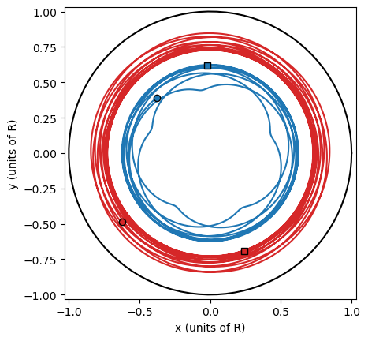
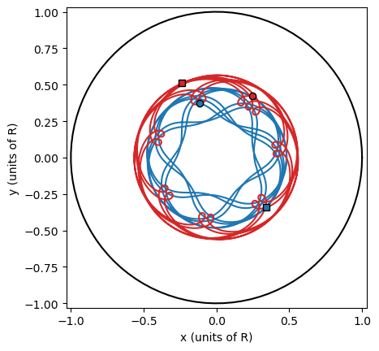
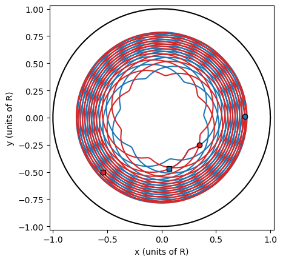

# VortexPointDynamics

# Overview

VortexPointDynamics is a Python simulation tool for modelling vortex point dynamics in a circular domain based on Hamiltonian mechanics. The code aims to offer insights into complex vortex interactions using various techniques.

## Features

- Simulation of N-vortex motion using numerical intergration.
- Visualisation of vortex trajectories and Poincaré sections.
- Estimation of Lyapunov Exponents.
- Supports configuration of key simulation parameters such as the number of vortices, domain radius, time step, and total simulation time.
- includes options for initial conditions (including whether or not the vortices are placed randomly) and numerical methods (e.g. RK4 or Euler).
- Allows toggling of features such as trajectory plotting, generating Poincaré sections, and calculating Lyapunov Exponents.

## Installation

Clone the repository and install the required dependencies:

```
git clone https://github.com/nmajozi-04/VortexPointDynamics.git
cd VortexPointDynamics
pip install -r requirements.txt
```

## Initial Conditions and Example Plots

below are some of the initial conditions which produced results I found interesting:

A) **conditions:**

R = 1  
dt = 0.00001  
total_time = 7  

position_init = [(-0.02, 0.62), (0.24, -0.69)]  
circulations = [-5.0, -5.0]  

**plot:**



B) **conditions:**

R = 1  
dt = 0.00001  
total_time = 8  
 
position_init = [(0.34, -0.34), (-0.24, 0.51)]  
circulations = [5.0, -5.0]  

**plot:**



C) **conditions:**

R = 1  
dt = 0.00001  
total_time = 10  

position_init = [(0.07, -0.47), (-0.54, -0.5)]  
circulations = [5.0, 5.0]  

**plot:**



## Technical Details

- **Long Run Times for Detail:**

To obtain sufficiently detailed Poincaré sections and accurate Lyapunov Exponents, the simulation requires a long `total_time` (≈ 200) and a very fine time step (`dt` ≈ 0.00001). This combination leads to long computation times.

- **Numerical Considerations Near Boundaries:**

The Hamiltonian is the sum of vortex-vortex interaction terms and vortex-boundary interaction terms. The vortex-boundary interaction term has something that's proportional to `log(1 - r²/R²)` in it, where r is the distance of a vortex from the origin. So when a vortex is close to the boundary `r ≈ R`, so `1 - r²/R² ≈ 0`. This means the magnitude of the log part of the vortex-boundary interaction term blows up and destabilises our numerical solvers. To mitigate this, the `random_point` function in the code restricts the maximum value of r to 0.9, ensuring vortices placed randomly don't start too close to the boundary.

- **Lyapunov Exponent Considerations:**

The Lyapunov Exponent is found by measuring the distance between two nearby trajectories in phase space (the original trajectory and one with slightly perturbed initial conditions). A positive Lyapunov Exponent is a necessary and sufficient condition for determinsitic chaos, and so for an N-vortex system in a circular domain, you'd expect positive Lyapunov Exponents for N ≥ 3 and non-positive ones for N = 1,2. This generally manifests in the code for sufficiently long `total_time` (and allowing for slight numerical errors), but there are a couple of caveats:

1) the size of the Lyapunov Exponent: information can be gathered not only from the parity of the Exponent but also the magnitude. Larger positive Exponents typically mean the nearby trajectories diverge from each other even faster, so the system is more chaotic. For `R = 1, N = 3` the Lyapunov Exponent is always rather small. I've yet to verify if this is a property of the set up or of the motion itself. Since the domain is so small it might be that the trajectories just can't get very far away from each other very quickly, artificially minimising the size of the Exponent. However, it could also be that since N = 3 vortices is a rather small amount, the motion isn't actually that chaotic and the Exponent would be bigger for higher N.

2) Consistency with Theory: There are a couple of example I've found for N = 3 vortices where the Exponent actually came to be negative. These examples are few and far between, as yet I've only seen two of them, but I'm still interrogating the issue to find out what might be going wrong. I suspect it's entirely a problem of numerical accuracy (since we need long `total_time` for detailed Exponents, but the longer the simulation runs for the more the numerical errors pile-up), which I plan to fix as I state in more detail in the next point.

- **Future Improvements:**

I plan to improve the code in the near future in a number of ways including implementing parallel processing to reduce simulation time, refactoring the code to support module-based import for easier integration into other projects, implementing symplectic integrators to minimise energy drift in the Hamiltonian system and increase numerical accuracy in the simulations, and a parameter that varies the Dirichlet boundary conditions (e.g. an option for the motion to be restricted to a half-plane, or a quadrant on the plane).

## References

- Reference paper:

Anderson V. Murray, Andrew J. Groszek, Pekko Kuopanportti, and Tapio Simula, "Hamiltonian dynamics of two same-sign point vortices," *Physical Review A*, **93**, 033649, 2016 [Link to journal page](https://journals.aps.org/pra/abstract/10.1103/PhysRevA.93.033649)

Paul K. Newton, *The N-Vortex Problem: Analytical Techniques*, Springer, 2001 [Link to book](https://link.springer.com/book/10.1007/978-1-4684-9290-3)
